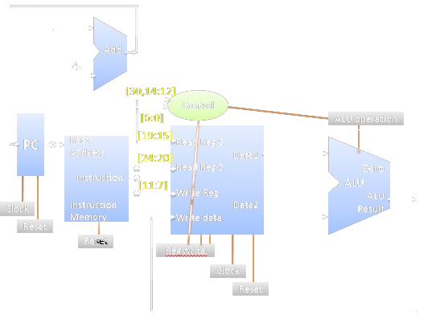

# RISC-V Processor Implementation in Verilog

This project implements a simplified RISC-V processor in Verilog, showcasing the fundamental components and their interconnections for executing RISC-V instructions. The design includes modules such as the ALU, Register File, Control Unit, and Instruction Fetch Unit, with corresponding testbenches for verification. This project is implemented in Xilinx ISE 8.1i.

## Project Structure

The implementation follows a hierarchical design:
- **Level 1 (Processor)**: The top-level module that integrates the control and datapath units.
- **Level 2 (Control and Datapath)**:
  - **Control Unit**: Decodes instructions and generates control signals.
  - **Datapath**: Executes instructions using functional modules (ALU, Register File, etc.).
  - **Instruction Fetch Unit (IFU)**: Fetches instructions from memory.
- **Level 3 (Functional Modules)**:
  - **ALU**: Performs arithmetic and logic operations.
  - **Register File**: Stores 32 general-purpose registers for instruction execution.
  - **Instruction Memory (INST_MEM)**: Holds the instruction set.

### Files

- `PROCESSOR.v`: Top-level processor module.
- `CONTROL.v`: Control unit to decode instructions.
- `DATAPATH.v`: Connects functional modules like ALU and Register File.
- `ALU.v`: Arithmetic Logic Unit to perform operations based on control signals.
- `REG_FILE.v`: Register file for storing and reading register data.
- `IFU.v`: Instruction Fetch Unit to retrieve instructions from memory.
- `INST_MEM.v`: Instruction memory containing machine code.
- **Testbenches**: Testbenches for each module to verify functionality.

### Testbenches

Testbenches are provided to verify each module's functionality:
- `tb_PROCESSOR.v`: Verifies the overall processor.
- `tb_IFU.v`, `tb_DATAPATH.v`, `tb_ALU.v`: Testbenches for individual modules.

